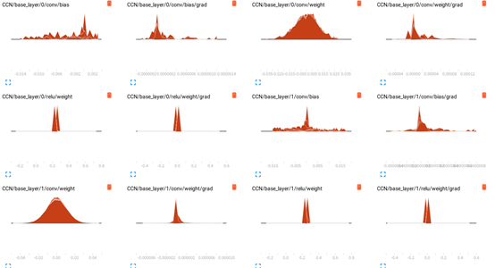

# chapter7-Learning-Cascaded-pytorch

aim: counting the number of people in the picture

------

In addition to studying the author's GitHub（https://github.com/svishwa/crowdcount-cascaded-mtl）, I also made some other efforts.

1. The author used Crayon in docker for training visualization，I tried to use tensorboard for training visualization.
2. I also tried to visualize the network structure.
3. I also debugged the training and testing process step by step.

yeah，I learned a lot.

------

## step1.Network


## step2. Install

For the specific installation process, you can refer to the author's github. Here I simply show the command line of my operation.

```
1.conda create -n Cascaded-pytorch python=3.6
2.source activate Cascaded-pytorch
3.unzip crowdcount-cascaded-mtl-master.zip
4.pip install -i https://pypi.tuna.tsinghua.edu.cn/simple torch torchvision
5.pip install decorator cloudpickle>=0.2.1 dask[array]>=1.0.0 matplotlib>=2.0.0 networkx>=1.8 scipy>=0.17.0 bleach python-dateutil>=2.1 decorator
6.unzip ShanghaiTech_Crowd_Counting_Dataset.zip
```

## step3. make datasets

Tool：MATLAB

```
7.run create_gt_test_set_shtech.m in matlab to create ground truth files for test data
8.run create_training_set_shtech.m in matlab to create training and validataion set along with ground truth files
```

## step4. Training

these code will be changed on the source file：

- In data_loader.py：

  ​            

  ```
  sys.maxint-------->sys.maxsize
  Line 25:self.id_list = list(range(0,self.num_samples))
  ```

  

- In train.py: 

  ​           

  ```
  sys.maxint-------->sys.maxsize
  train_loss += loss.data[0]------------>train_loss += loss.item()
  ```

  

- Then......run train.py

  ```
  python train.py
  ```

  

------

**Training with TensorBoard**

a new **logger.py**，you can copy my file

and....then，add these code to **train.py**:

```
set use_tensorboard = True
```

```
from logger import Logger

logger = Logger('logs')
```

```
###############These codes are modified according to your own needs.
# 1. Log scalar values (scalar summary)
info = { 'MAE': mae.item(), 'MSE': mse.item() } #这里只需要将loss和accuracy提供出来就行。注意这里不是tensor也不是numpy array而是单个的scalar

for tag, value in info.items():
    logger.scalar_summary(tag, value, step+1)

# 2. Log values and gradients of the parameters (histogram summary)#这里是针对所有的parameters和gradient来做histogram
for tag, value in net.named_parameters():
    tag = tag.replace('.', '/')
    logger.histo_summary(tag, value.data.cpu().numpy(), step+1)
    logger.histo_summary(tag+'/grad', value.grad.data.cpu().numpy(), step+1)

# 3. Log training images (image summary)
info = { 'im_data': im_data.view(-1, 28, 28)[:10].cpu().numpy() }

for tag, im_data in info.items():
    logger.image_summary(tag, im_data, step+1)
```

During training: You need to operate it in two terminals separately

```
tensorboard  --logdir logs
firefox  http://imc-NO108:6006
```


## 

## step5.Testing

These are our test images. number：182


run **python test.py**


MAE：Average error between predicted and true values

MSE：Average variance of predicted and true values

------

**Testing with single image**

you need three .py files of mine：

image.py， make_dataset.py，  test_single-image.py

1. first.    run   **python make_dataset.py**
2. then   run    **python test_single-image.py**


another one

